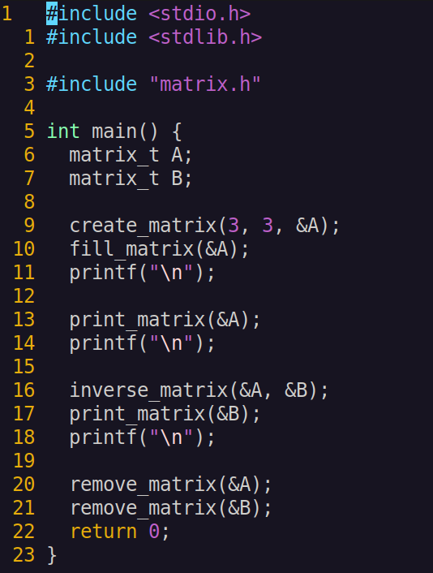

# Matrix library

## __Description of project:__

__In this project I developed library for basic operations with matrices in the C programming language.__

Matrices are one of the basic data structures in programming, e.g. they are used to represent table values, for computational tasks and neural networks.

Verifiable accuracy of the fractional part is up to 6 decimal places.

The library developed in accordance with the principles of structured programming as a static library (with the header file my_math.h) in C programming language of C11 standart.

## Matrix operations

All operations (except matrix comparison) return the resulting code:
- 0 - OK
- 1 - Error, incorrect matrix
- 2 - Calculation error (mismatched matrix sizes; matrix for which calculations cannot be performed, etc.)

### Creating matrices (create_matrix)

```c
int create_matrix(int rows, int columns, matrix_t *result);
```

### Cleaning of matrices (remove_matrix)

```c
void remove_matrix(matrix_t *A);
```

### Matrix comparison (eq_matrix)

```c
int eq_matrix(matrix_t *A, matrix_t *B);
```

SUCCESS = 1

FAILURE = 0

### Adding (sum_matrix) and subtracting matrices (sub_matrix)

```c
int sum_matrix(matrix_t *A, matrix_t *B, matrix_t *result);
int sub_matrix(matrix_t *A, matrix_t *B, matrix_t *result);
```

### Matrix multiplication by scalar (mult_number). Multiplication of two matrices (mult_matrix)

```c
int mult_number(matrix_t *A, double number, matrix_t *result);
int mult_matrix(matrix_t *A, matrix_t *B, matrix_t *result);
```

### Matrix transpose (transpose)

```c
int transpose(matrix_t *A, matrix_t *result);
```

### Minor of matrix and matrix of algebraic complements (calc_complements)
```c
int calc_complements(matrix_t *A, matrix_t *result);
```

### Matrix determinant

```c
int determinant(matrix_t *A, double *result);
```

### Inverse of the matrix (inverse_matrix)

```c
int inverse_matrix(matrix_t *A, matrix_t *result);
```

## __Compilation:__
Use make utility for building the library and tests.

## __Usage:__
Write some example code:



Compile code with library using gcc:


